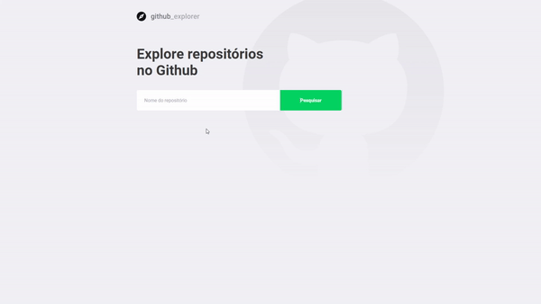

<p align="center">
  

  

  <a href="https://github.com/rntdc/github-explorer/commits/master">
    
  </a>
</p>


### Web

<p align="center" style="display: flex; align-items: flex-start; justify-content: center;">
  
</p>

<p align="center" style="display: flex; align-items: flex-start; justify-content: center;">
  
</p>


#### Rodando a aplicação

```bash

# Clone este repositório
$ git clone https://github.com/rntdc/github-explorer

# Acesse a pasta do projeto no seu terminal/cmd
$ cd github-explorer

# Instale as dependências
$ npm install ou yarn

# Execute a aplicação em modo de desenvolvimento
$ npm start ou yarn start

# A aplicação será aberta na porta:3000 - acesse http://localhost:3000

```
## Autor

 
 Renato 👋🏽 [Entre em contato!](https://www.linkedin.com/in/renato-dekeches-272417151/)
